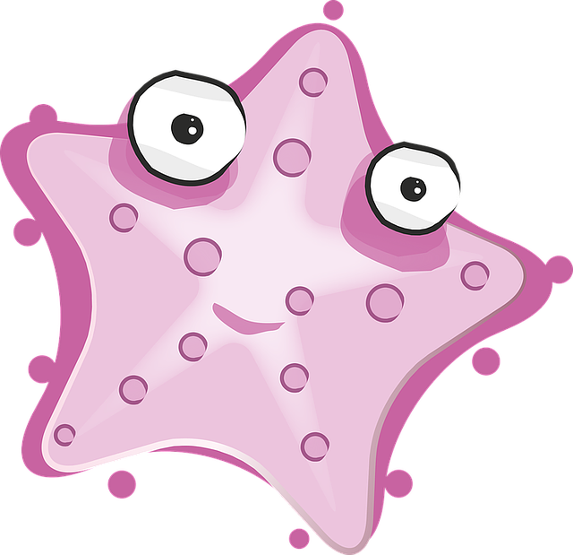

## Project Starfish 😎

This is just a simple .NET 7 web api project to practice new packages and APIs.

Includes:
- .NET 7
- Entity Framework 7
- Clean architecture
- GRPC services
- Global exception handler
- Change token sample (GuestListSource)
- Custom configuration provider (Read settings from database)
- BenchmarkDotNet
- Docker files
- Rate limiting
- ...

And will include:
- GitHub actions
- IAC (Azure or AWS)

